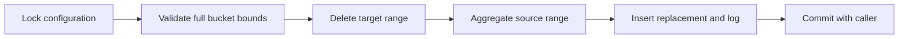

# Rollup engine design

## Data and ownership

A configuration describes one source and one exclusively owned target. The target has a primary key on timestamp plus frozen dimensions. Creation records metric names and, for a derived rollup, a parent configuration ID. Catalog-derived type names and quoted identifiers are used for DDL; range values are bound parameters in refresh SQL.

Numeric state consists of minimum, maximum, sum, non-null count, and mean. Raw metrics are cast to PostgreSQL `numeric` for sums and means; floating-point inputs retain only the precision already present in their stored source values. Derived means divide summed metric sums by summed metric counts, without averaging bucket means. `rollup_count` separately preserves raw observation counts. No numeric state is inferred from legacy columns merely because their names begin with `avg_` or `min_`.

## Refresh transaction

An explicit refresh takes the configuration row lock with `NOWAIT`, rejects partial buckets, and replaces the entire requested range. Removal of vanished groups is part of this operation. If inserting the aggregate or writing its success log fails, the function's statement fails; an enclosing worker exception block rolls back the entire attempted refresh. Direct callers must roll back their failed transaction, as with any failed SQL statement.

Each refresh validates its specific configuration against the current catalogs before changing rows. Missing columns, changed dimension types, and narrowed numeric precision are rejected. Historical log and watermark row-count columns retain their integer signatures, so keep each refresh below 2,147,483,648 output groups; exceeding that limit fails atomically rather than truncating the count.

The source is read using the statement snapshot of the aggregate insert. Source ingestion is not locked: observations committed after that snapshot can be incorporated by subsequent overlap or manual refresh. This is eventual completeness within the selected refresh policy, not a claim of synchronizing source writes with ingestion.

## Incremental worker

Eligible configurations are claimed with `FOR UPDATE SKIP LOCKED` in ID order. Targets created from existing rollups have larger IDs than their parents. The worker computes complete UTC bucket bounds from the source minimum or completed watermark, lateness cutoff, and processing window. A derived target also respects the parent watermark. One call processes at most one forward window plus one capped overlap window per configuration.

Config row locks are acquired outside the per-job exception block. Failure rolls back job writes while retaining the lock needed to record error and retry state. SQL errors in one configuration are caught so other configurations can proceed. PostgreSQL cancellations and connection failures abort the transaction instead of being swallowed; all its writes and locks roll back normally.

All claimed locks last until the surrounding transaction ends. Call workers in short, dedicated transactions. Long outer transactions reduce concurrency and delay the visibility of monitoring state. Changes made manually to target tables bypass this ownership protocol and are outside the worker's concurrency guarantee.

## Backfill and late data

Manual refresh never moves the scheduled watermark; a disjoint historical refresh cannot falsely claim that every earlier range was completed. Refresh rollup chains in parent-first order. The worker's watermark guard prevents normal child processing from running ahead, but does not itself propagate a correction to an already processed child bucket. Configure sufficient overlap at each level or explicitly refresh all affected levels.

An initial empty source has no watermark. Once an initialized job crosses an empty range, its watermark advances. New observations behind that watermark require overlap or backfill. Source retention and deletions are external policies; refreshing a range whose original observations have expired will replace its target values with the remaining source data, potentially deleting them entirely. Select backfill ranges only where the intended source history is available.

## Partition modes

Both modes use native PostgreSQL range partitioning. Portable mode has a default partition and intentionally delegates rotation/retention to the operator. When pg_partman 5+ is installed, target creation registers daily partitions and retention in its installed schema. Historical rows can land in a default partition; use pg_partman's data migration procedures to move them before creating overlapping partitions. Production extension behavior must be validated with the deployed extension version.

Useful upstream references: [PostgreSQL row locking](https://www.postgresql.org/docs/14/sql-select.html#SQL-FOR-UPDATE-SHARE), [date_bin](https://www.postgresql.org/docs/14/functions-datetime.html#FUNCTIONS-DATETIME-BIN), and [pg_partman documentation](https://github.com/pgpartman/pg_partman/blob/master/doc/pg_partman.md).
