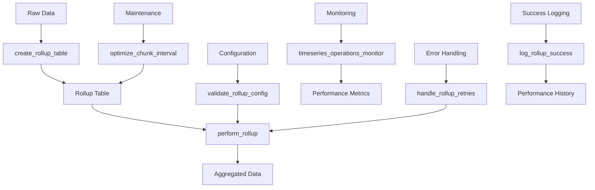

# Timeseries Data Management System

This system provides a comprehensive solution for managing time-series data in PostgreSQL, featuring exponential rollup strategies, adaptive processing windows, comprehensive monitoring, and robust error handling with automated retry mechanisms.

## Core Components

### Configuration Tables

1. **timeseries_rollup_config**
   - Primary configuration table for rollup operations
   - Key fields:
     - `source_table`: Source table for data
     - `target_table`: Destination for aggregated data
     - `rollup_table_interval`: Time interval for aggregation
     - `look_back_window`: How far back to process data
     - `processing_window`: Size of processing chunks
     - `status`: Current processing status (idle, processing, error)
     - `worker_id`: ID of processing worker
     - `retry_count`: Number of retry attempts
     - `alert_threshold`: Time threshold for alerts
     - `max_execution_time`: Maximum allowed execution time
     - `next_retry_time`: Scheduled retry time with exponential backoff

2. **timeseries_dimension_config**
   - Manages dimension columns for rollup operations
   - Fields:
     - `source_table`: Source table name
     - `dimension_column`: Column to use as dimension
     - `description`: Column description
     - `is_active`: Whether dimension is active

3. **timeseries_refresh_log**
   - Logs successful rollup operations
   - Tracks:
     - Processing duration
     - Records processed
     - Start/end times
     - Table statistics
     - Performance metrics

4. **timeseries_error_log**
   - Comprehensive error logging
   - Captures:
     - Error messages and SQL state
     - Context and hints
     - Attempted queries
     - Timestamp information
     - Retry attempt details

### Core Functions

1. **Time Bucket Functions**
   - `silver.time_bucket(bucket_width INTERVAL, ts TIMESTAMPTZ)`
     - Buckets timestamps into fixed-width intervals
     - Optimized for common intervals (second, minute, hour, day)
     - Handles custom intervals via epoch calculations

2. **Value Functions**
   - `silver.first_value(value_column ANYELEMENT, time_column TIMESTAMPTZ)`
     - Returns first value in time-ordered sequence
   - `silver.last_value(value_column ANYELEMENT, time_column TIMESTAMPTZ)`
     - Returns last value in time-ordered sequence

3. **Performance Monitoring**
   - `silver.get_detailed_stats(table_pattern TEXT)`
     - Comprehensive table statistics
     - Monitors:
       - Table and index sizes
       - Row counts
       - Cache performance
       - I/O rates

4. **Operations Monitoring**
   - `silver.timeseries_operations_monitor` (View)
     - Real-time operation status
     - Health status (OK, WARNING, ALERT)
     - Processing metrics and error tracking
     - Performance statistics

### Rollup Management

1. **Table Creation**
   - `silver.create_rollup_table(source_table_name TEXT, ...)`
     - Creates new rollup tables
     - Handles:
       - Dimension columns
       - Statistical aggregations
       - Partitioning setup
       - Index creation
       - Permission management

2. **Rollup Processing**
   - `silver.perform_rollup(specific_table TEXT)`
     - Main rollup execution function
     - Features:
       - Adaptive processing windows
       - Concurrent execution handling with optimistic locking
       - Error recovery and retry mechanisms
       - Progress tracking
       - System load balancing
       - Real-time monitoring integration

   **Detailed Process Flow:**
   ```mermaid
   flowchart TD
       A[Start] --> B[Get Active Configs]
       B --> C{For Each Config}
       C --> D[Acquire Lock]
       D --> E{Lock Acquired?}
       E -->|No| C
       E -->|Yes| F[Calculate Window]
       F --> G[Process Data Chunk]
       G --> H[Update Progress]
       H --> I{More Data?}
       I -->|Yes| F
       I -->|No| C
       C --> J[End]

       subgraph "Window Calculation"
           F --> F1[Check Past Performance]
           F1 --> F2[Check System Load]
           F2 --> F3[Adjust Window Size]
       end

       subgraph "Data Processing"
           G --> G1[Process Dimensions]
           G1 --> G2[Process Numeric Columns]
           G2 --> G3[Process Non-numeric Columns]
           G3 --> G4[Execute Rollup Query]
       end

       subgraph "Error Handling"
           G --> G5{Error?}
           G5 -->|Yes| G6[Log Error]
           G6 --> G7[Set Retry Time]
           G5 -->|No| G8[Log Success]
       end
   ```

   **Key Steps:**
   1. **Configuration Loading**
      - Retrieves active rollup configurations
      - Filters by specific table if provided
      - Checks for stale processing tasks (>alert_threshold)

   2. **Concurrency Management**
      - Uses optimistic locking with worker_id
      - Handles stale tasks with configurable thresholds
      - Prevents duplicate processing
      - Tracks worker status and execution time

   3. **Window Calculation**
      - Determines processing range:
        ```sql
        start_time = last_processed_time or (now() - look_back_window)
        end_time = min(now() - safety_buffer, start_time + processing_window)
        ```
      - Adaptive safety buffers:
        - 1s intervals: 30-second buffer
        - 1m intervals: 1-minute buffer
        - Larger intervals: 1x interval buffer

   4. **Column Processing**
      - Dimension columns:
        - Preserves original values
        - Groups by these columns
      - Numeric columns:
        - Creates min/max/avg variants
        - Handles integer and floating-point types
      - Non-numeric columns:
        - JSONB: Creates array aggregations
        - Other types: Uses MODE() aggregation

   5. **Query Construction**
      ```sql
      INSERT INTO target_table (columns)
      SELECT 
          time_bucket(interval, timestamp),
          dimension_columns,
          MIN(numeric_cols),
          MAX(numeric_cols),
          AVG(numeric_cols),
          array_agg(jsonb_cols),
          MODE() WITHIN GROUP (ORDER BY other_cols)
      FROM source_table
      WHERE timestamp >= start_time 
        AND timestamp < end_time
      GROUP BY time_bucket, dimensions
      ON CONFLICT (timestamp, dimensions) 
      DO UPDATE SET ...
      ```

   6. **Adaptive Processing**
      ```mermaid
      flowchart LR
          A[Input Data] --> B{Check Interval}
          B -->|1s| C[2min Buffer]
          B -->|1min| D[3min Buffer]
          B -->|Other| E[2x Interval]
          
          C --> F[Processing Window]
          D --> F
          E --> F
          
          F --> G{System Load}
          G -->|High| H[Reduce Window]
          G -->|Normal| I[Keep Window]
          
          H --> J[Process Chunk]
          I --> J
      ```

   7. **Error Handling & Retry**
      - Records errors in timeseries_error_log
      - Implements exponential backoff retry mechanism
      - Preserves partial progress
      - Updates retry statistics
      - Configurable retry limits and thresholds

   8. **Progress Tracking**
      - Updates last_processed_time
      - Records processing statistics
      - Calculates moving averages
      - Logs success metrics via `log_rollup_success()`

   9. **Performance Optimization**
      - Adjusts window size based on:
        - System load (reduces if high)
        - Processing time (adapts to performance)
        - Row count thresholds
      - Updates processing_window for next run

   10. **Monitoring Integration**
       - Updates operations monitor view
       - Records performance metrics
       - Tracks success/failure rates
       - Provides real-time status

3. **Maintenance Functions**
   - `silver.optimize_chunk_interval(table_name TEXT)`
     - Optimizes partition sizes based on data ingestion rates
     - Considers:
       - Data volume and row counts
       - Ingestion rate calculations
       - Target chunk size (default 256MB)
   
   - `silver.maintain_timeseries_tables(target_table_name TEXT)`
     - Performs routine maintenance
     - Optimizes chunk intervals
     - Updates configurations
     - Runs statistics updates

   - `silver.get_partition_stats(parent_table_name TEXT)`
     - Detailed partition statistics
     - Size and row counts
     - Performance metrics
     - Bytes per row calculations

4. **Validation and Monitoring**
   - `silver.validate_rollup_config()`
     - Validates configuration completeness
     - Checks table structures
     - Verifies column existence
   
   - `silver.timeseries_operations_monitor` (View)
     - Real-time operation status
     - Health status indicators
     - Error tracking and retry counts
     - Performance metrics

### Error Handling and Retry Mechanism

1. **Retry Management**
   - `silver.handle_rollup_retries()`
     - Manages failed rollups with exponential backoff
     - Processes retry queue based on next_retry_time
     - Tracks retry attempts and success rates
     - Updates error logs with detailed context

2. **Success Logging**
   - `silver.log_rollup_success(table_name, start_time, end_time, records_processed)`
     - Records successful operations
     - Tracks performance metrics
     - Maintains processing history
     - Calculates duration and throughput

3. **Error Recovery**
   - Comprehensive error logging with SQL state
   - Exponential backoff strategy (5min * 2^retry_count)
   - Configurable retry limits and thresholds
   - Alert mechanisms for repeated failures

## Usage Examples

### Creating a New Rollup Table

```sql
-- Configure dimension columns
INSERT INTO silver.timeseries_dimension_config (source_table, dimension_column, description)
VALUES 
    ('schema.source_table', 'company_name', 'Company identifier'),
    ('schema.source_table', 'site_name', 'Site location');

-- Create rollup table
SELECT silver.create_rollup_table(
    source_table_name := 'schema.source_table',
    target_schema := 'schema',
    target_table_name := 'target_table',
    rollup_table_interval := '15 minutes'::interval,
    look_back_window := '10 minutes'::interval,
    retention_period := '60 days'::interval
);
```

### Executing Rollups

```sql
-- Process all tables
SELECT silver.perform_rollup();

-- Process specific table
SELECT silver.perform_rollup('schema.specific_table');
```

### Monitoring and Maintenance

```sql
-- Check real-time operations status
SELECT * FROM silver.timeseries_operations_monitor;

-- Check table statistics
SELECT * FROM silver.get_detailed_stats('%_timeseries');

-- Validate configurations
SELECT * FROM silver.validate_rollup_config();

-- Handle retries
SELECT silver.handle_rollup_retries();

-- Optimize partitions
SELECT silver.optimize_chunk_interval('schema.table_name');
```

## System Architecture



## Best Practices

1. **Configuration**
   - Set appropriate look_back_window based on data latency
   - Configure alert_threshold for your SLA requirements
   - Use dimension columns for efficient querying
   - Set reasonable max_execution_time limits

2. **Performance**
   - Monitor partition sizes regularly with get_partition_stats()
   - Adjust processing_window based on system load
   - Keep retry_count thresholds reasonable
   - Use optimize_chunk_interval() for large tables

3. **Maintenance**
   - Schedule regular validation checks
   - Monitor error logs for patterns
   - Adjust chunk intervals based on data volume
   - Set up automated maintenance cron jobs

4. **Error Handling**
   - Review error_log regularly
   - Set up alerts for repeated failures
   - Monitor retry patterns
   - Configure appropriate retry limits

5. **Monitoring**
   - Use timeseries_operations_monitor for real-time status
   - Track success rates and performance metrics
   - Monitor partition statistics
   - Set up alerts for health status changes 